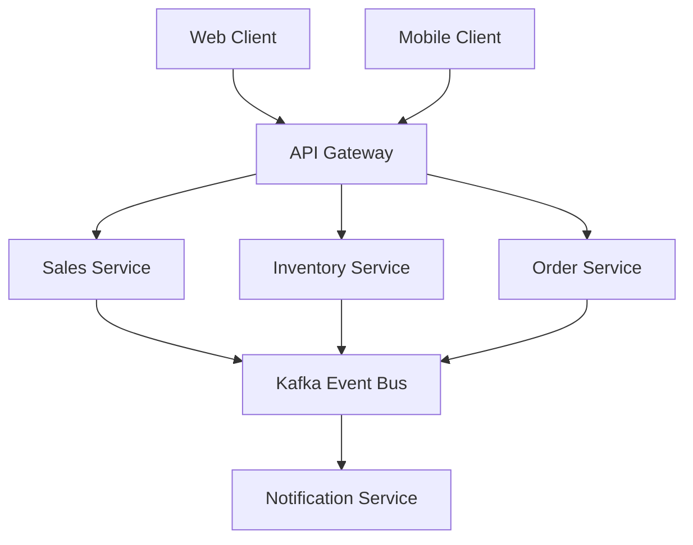

# 🌟 Multichannel Sales Management System
<h1 align="center">
  <a href="http://www.amitmerchant.com/electron-markdownify"></a>
</h1>

## 🎯 Overview

Enterprise-grade B2B multichannel sales and inventory management solution powered by modern microservices architecture. The system delivers an optimized user experience across web and mobile platforms with real-time business event handling.

## ✨ Key Features

🛍️ **Sales Management**
- Comprehensive B2B multichannel sales handling
- Smart order processing
- Client relationship management

📦 **Inventory Control**
- Real-time stock tracking
- Automated reordering system
- Warehouse optimization

🌐 **Platform Coverage**
- Responsive web interface
- Native mobile experience
- Cross-platform synchronization

⚡ **Performance**
- 20% faster inter-service communication
- Real-time event streaming
- Scalable architecture

## 🔧 Tech Stack

### 🎯 Backend
- **☕ Java Spring Boot**: Core microservices framework
- **🚀 Apache Kafka**: Real-time event streaming
- **🔌 Feign Client**: Enhanced inter-service communication
- **🌐 RESTful APIs**: Service-oriented architecture

### 💻 Frontend
- **⚛️ ReactJS**: Web interface
- **📱 React Native**: Mobile application
- **🔄 Redux**: State management
- **🎨 Material-UI**: UI components

## 🏗️ System Architecture



## 🚀 Prerequisites

🛠️ Make sure you have the following installed:
- ☕ Java JDK 17+
- 📦 Node.js 18+
- 🐳 Docker & Docker Compose
- 🚀 Apache Kafka
- 🔨 Maven/Gradle

## ⚙️ Installation

1. 📥 **Clone the repository**
```bash
git clone https://github.com/your-organization/multichannel-sales-project.git
cd multichannel-sales-project
```

2. 🔑 **Environment Setup**
```bash
# Configure environment variables
cp .env.example .env
```

3. 🚀 **Launch Services**
```bash
# Start Kafka and dependencies
docker-compose up -d

# Launch microservices
cd backend
./mvnw spring-boot:run

# Start web frontend
cd frontend/web-client
npm install
npm start

# Launch mobile app
cd frontend/mobile-client
npm install
npm run ios # or npm run android
```

## 📊 Performance Metrics

🚀 **System Capabilities**
- ⚡ Load balancing with Feign
- 📈 20% performance boost in inter-service calls
- 🔄 Horizontal scaling support
- 💪 High traffic handling

## 🔐 Security Features

🛡️ **Security Measures**
- 🔑 JWT Authentication
- 👥 Role-based Authorization
- 🔒 Secure Service Communication
- 🗝️ Data Encryption

## 📚 API Documentation

Visit our interactive API documentation:
```
http://localhost:8080/swagger-ui.html
```

## 🤝 Contributing

1. 🔱 Fork the project
2. 🌿 Create your feature branch (`git checkout -b feature/amazing-feature`)
3. 💾 Commit changes (`git commit -m 'Add amazing feature'`)
4. 📤 Push to branch (`git push origin feature/amazing-feature`)
5. 🎯 Open a Pull Request

## 📋 Project Structure

```
🏗️ Project Root
├── 🔧 backend/
│   ├── 🛍️ sales-service/
│   ├── 📦 inventory-service/
│   ├── 📝 order-service/
│   └── 📨 notification-service/
├── 💻 frontend/
│   ├── 🌐 web-client/
│   └── 📱 mobile-client/
└── 🚀 kafka/
    └── ⚡ event-streaming/
```

## 📜 License

This project is licensed under the MIT License - see the `LICENSE` file for details.

## 💬 Support & Contact

Need help? We've got you covered!

📧 **Email Support**: support@your-organization.com  
📚 **Documentation**: [link-to-docs]  
🐛 **Issue Tracking**: [link-to-issues]  
💭 **Community Chat**: [link-to-chat]

## 🌟 Acknowledgments

- 🙏 Thanks to all contributors
- 💪 Built with modern tech stack
- 🚀 Powered by Spring Boot & React

---
⭐ Don't forget to star this repo if you find it useful!

---
<div align="center">
  Made with ❤️ in Morocco
</div>
